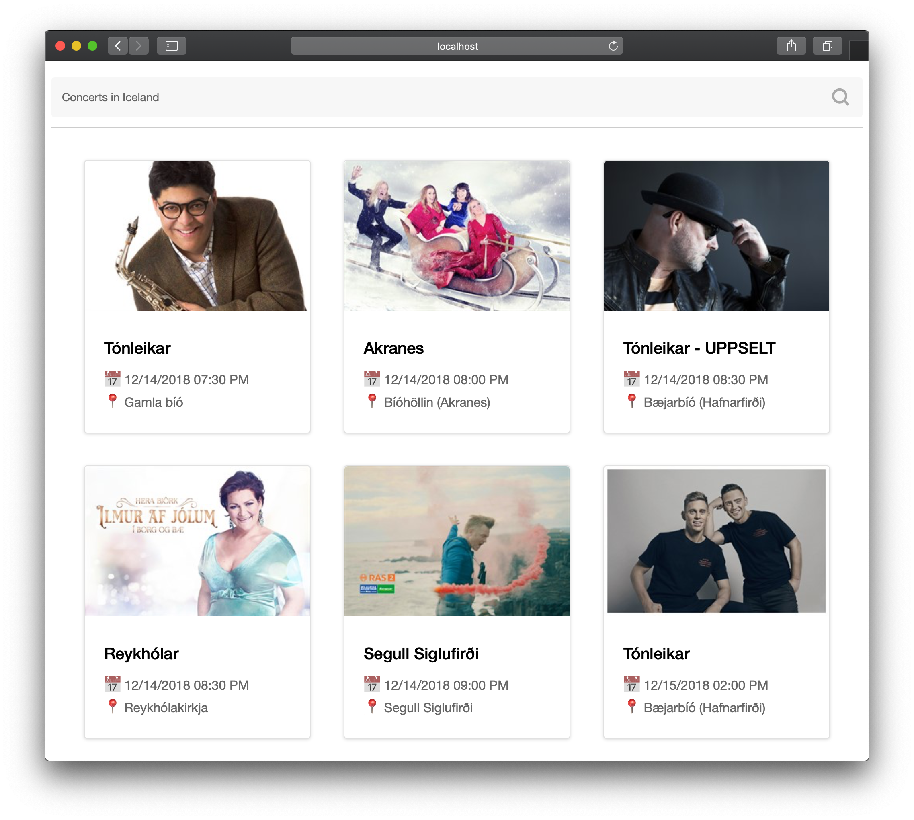

# Fusion.js + Base UI Example App

Get started by running the application with `yarn` and `yarn dev` in a terminal.

## What are we going to build?

### Features

- using [3rd party public API](http://docs.apis.is/#endpoint-concerts) that lists upcoming concerts in Iceland
- responsive layout using CSS Grid and BaseUI components
- universally rendered (one of the perks of Fusion.js)
- RPC endpoint so the client doesn't have to do cross-origin requests

## More resources

For detailed documentation please visit:

- https://fusionjs.com
- https://baseui.design/
